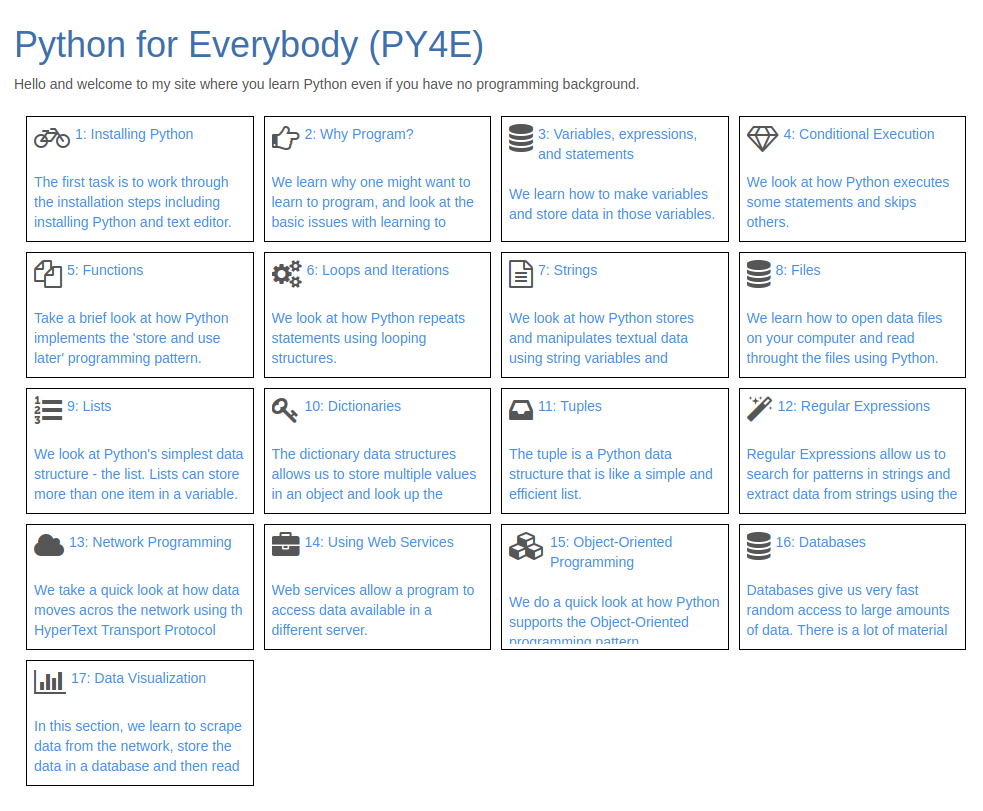
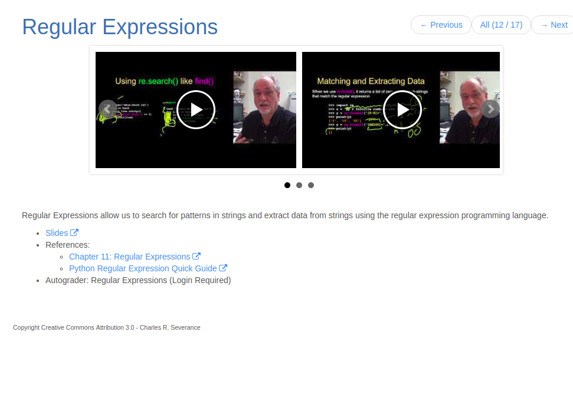
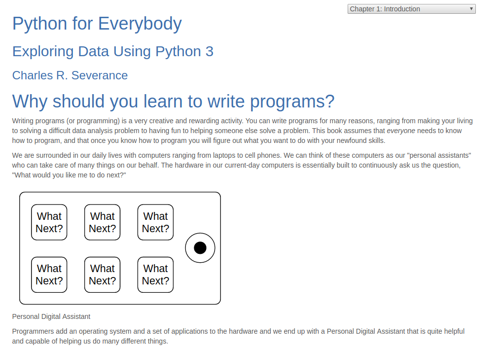
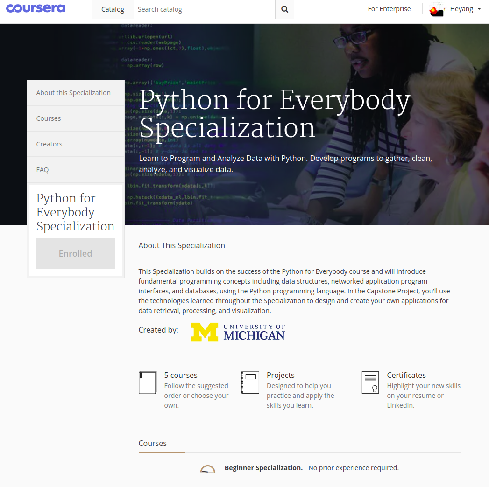

 
&nbsp; *混沌巡洋舰深度学习训练营材料* 

----------------------------------------

Python已日益成为人工智能世界的通用语言，使用python正日益像使用英语一样成为人人必回的通用技能（已经开始列入一些省份的英语提纲）。

Python之所以能取得这样的江湖地位，第一是好学， 有时就像在说话， 二是它是个胶水语言，可以轻松承担起程序世界粘合剂的作用，三呢， 还是因为好学，结果很多人来贡献开源代码，使得出现了非常多优秀的开源库， 结果python开发几乎可以瞬间站在巨人的肩膀上， 那效率，就是飞一般的感觉了。 

人人都应该学点 python, 系统化的刻意训练掌握 python 是捷径！本文介绍一个非常**优质的 python 学习系统** ———— PY4E。

网址：https://www.py4e.com/

该学习系统是针对小白的，不需要编程基础。建议前往网页版本查看此文。

## PY4E 是什么？

 PY4E 就是 python for everybody 的缩写， 它一个非常优质的 python 学习系统，包含如下的内容

- 模块化的 python 知识讲解
- 理论和代码紧密结合的在线教材
- 精心设计的 Coursera 专项课程

首先看看 PY4E 的模块系统

> 1. 模块化的 python 知识讲解

每个模块包含视频，slides和其他相关资料。例如正则表达式模块如下：

> 2, 理论和代码紧密结合的在线教材

教材的每个章节，分别对应每个知识讲解模块。 教材地址：https://www.py4e.com/html3/

> 3, 精心设计的 Coursera 专项课程

该专项总共包含4个小课程和一个 Capstone， 四个课程分别是：

- Programming for Everybody (Getting Started with Python)
- Python Data Structures
- Using Python to Access Web Data
- Using Databases with Python

而 Capstone 是用项目来实践前面课程中内容，端对端的实现获取数据，处理数据和可视化数据！

## 有什么用？ 怎么用？

PY4E作为一个 内容丰富， 精心制作的 python 系统化刻意训练系统，是小白学习和掌握 python 的捷径。

1, 该课程学习体系，对于小白来说，是一个系统化训练 python 编程的途径。如果认真完成该系统化训练，选修 Coursera 的专项课程， 至少完成该专项的习题和编程（每门课程可以免费试用7天），那么，
你能获得扎实的 python 编程基础知识，让你的大脑里面长出对应于相应知识的神经元连接。值得注意的是，在选修这些课程的过程中，使用课程论坛和完成作业很重要。

2, 对于具有一定编程经验的人来说，PY4E或许内容不够深，个人觉得直接阅读该PY4E的在线教材部分，当成复习和巩固相关知识的工具。也可以使用它的 coursera 专项课程习题和编程作业考核自己。

## 局限性

PY4E 有几个可能的不足之处：

1， 它的全英语的，英语不好的同学学习有一定的困难。  
2， 该课程的免费部分内容不够详细，如果不选修它的 Coursera 专项，光看在线教材，并不容易让一个小白快速掌握基础 Python 编程。  
3， 通过它这个系统化训练，可以让小白快速掌握基础 Python 编程，但是内容深度可能不是很够。

尽管 PY4E 有这些可能的不足之处，它的作为一个系统化的基础 python 编程训练体系值得推荐！

